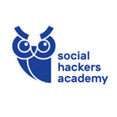
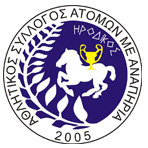
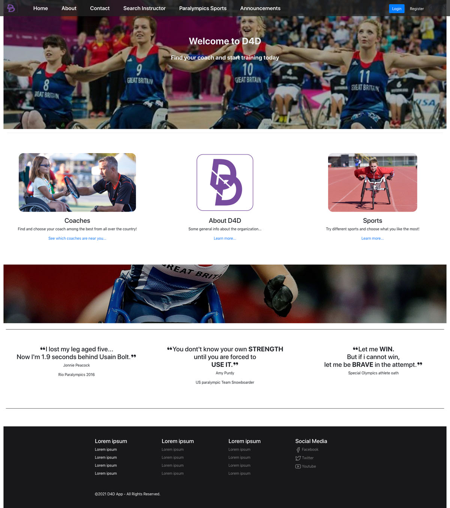
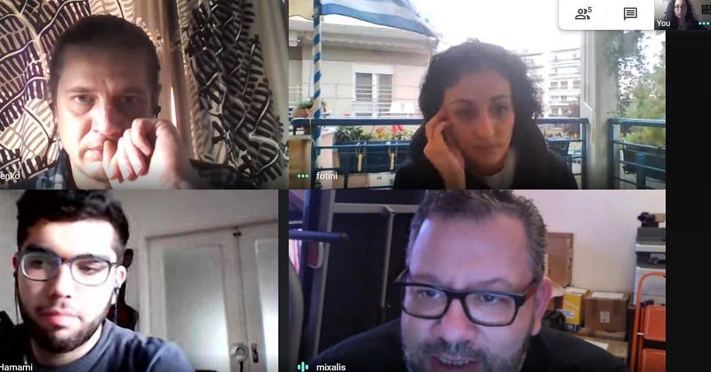

# The D4DApp Project

This repository contains the Code of the project, **D4DApp** as a result of the collaboration between the students of `Class 9` of [Social Hackers Academy](socialhackersacademy.org) and [Irodikos](https://www.facebook.com/irodikos/).

The project will help disabled persons to find athletic opportunities with expertised teachers and is coordinated by [Vadim Ovcearenco ](https://www.linkedin.com/in/vadim-ovcearenco-9754ab4/).

The collaboration was made possible through the support of the [Vodafone Foundation Greece](https://www.vodafone.gr/vodafone-ellados/idryma-vodafone/).

---

## Screenshot

## Technical Specifications

The Frontend application was created using [React.JS](https://reactjs.org/) by Facebook.

The backend uses `Node.JS`, `Express.JS` and `MySQL` as its database.

For installation instructions, please refer to the References [Frontend README](frontend/README.md) and [Backend README](backend/README.md).

---

Made with :heart: by SHA Class 9.